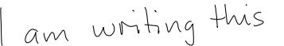
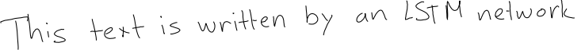
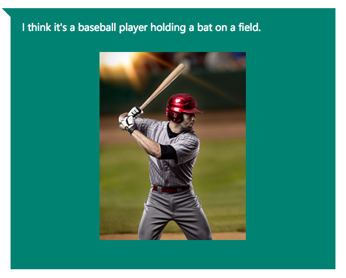

+++
date = "2017-02-17T12:56:49+01:00"
description = "Different use cases of LSTM neural network"
title = "The magic of LSTM neural networks"
categories = ["machine learning"]
tags = ["lstm", "neural networks", "applications", "text generation", "music generation", "image captioning", "handwriting"]
author = "Assaad Moawad"
image = "images/lstm/lstm.jpg"
+++

# Introduction
[LSTM Neural Networks] (https://en.wikipedia.org/wiki/Long_short-term_memory), which stand for **L**ong **S**hort-**T**erm **M**emory, are a particular type of recurrent neural networks that got lot of attention recently within the machine learning community.


In a simple way, LSTM networks have some internal **contextual state cells** that act as long-term or short-term memory cells.
The output of the LSTM network is **modulated** by the state of these cells. This is a very important property when we need the prediction of the neural network to depend on the **historical context** of inputs, rather than only on the very last input.

As a simple example, consider that we want to predict the next number of the following sequence:  6 -> 7 -> 8 -> ?. We would like to have the next output to be **9** (x+1). However, if we provide this sequence: 2 -> 4 -> 8 -> ?, we would like to get **16** (2x).
Although in both cases, the current last input was number **8**, the prediction outcome should be different (when we take into account the contextual information of previous values and not only the last one).

# How they work
LSTM networks manage to keep contextual information of inputs by integrating a *loop* that allows information to flow from one step to the next. These loops make recurrent neural networks seem magical. But if we think about it for a second, as you are reading this post, you are understanding each word based on your understanding of the previous words. You don’t throw everything away and start thinking from scratch at each word. Similarly, LSTM predictions are always conditioned by the past experience of the network's inputs.





On the other hand, the more time passes, the less likely it becomes that the next output depends on a very old input. This time dependency distance itself is as well a contextual information to be learned. LSTM networks manage this by **learning when to remember and when to forget**, through their forget gate weights. In a simple way, if the forget gate is just a multiplicative factor of 0.9, within 10 time steps this factor becomes: 0.9^10=0.348 (or 65% of information forgotten), and within 30 steps -> 0.04 (96% forgotten).



In this post, I won't go more than this about the technical details of LSTM. [This blog post instead] (http://colah.github.io/posts/2015-08-Understanding-LSTMs/) explains very nicely their mechanics. Instead I will present here a compilation of the different applications of LSTM.


# Examples of LSTM usage

## Text Generation
Generating a text, like this one, can be converted to an LSTM task where each letter is generated taking into account all the previously generated letters. In fact, [teaching an LSTM network the alphabet] (http://machinelearningmastery.com/understanding-stateful-lstm-recurrent-neural-networks-python-keras/) can be the first programming example to learn how to make LSTM learn something. [Andrej Karpathy,](http://karpathy.github.io/2015/05/21/rnn-effectiveness/) shows different examples of text generation by LSTM depending on the training set you feed them. These are some of the automatically generated text:

### Shakespeare:
```
PANDARUS:
Alas, I think he shall be come approached and the day
When little srain would be attain'd into being never fed,
And who is but a chain and subjects of his death,
I should not sleep.

Second Senator:
They are away this miseries, produced upon my soul,
Breaking and strongly should be buried, when I perish
The earth and thoughts of many states.
```


### Wikipedia:
```
Naturalism and decision for the majority of Arab countries' capitalide was grounded
by the Irish language by [[John Clair]], [[An Imperial Japanese Revolt]], associated
with Guangzham's sovereignty. His generals were the powerful ruler of the Portugal
in the [[Protestant Immineners]], which could be said to be directly in Cantonese
Communication, which followed a ceremony and set inspired prison, training. The
emperor travelled back to [[Antioch, Perth, October 25|21]] to note, the Kingdom
of Costa Rica, unsuccessful fashioned the [[Thrales]], [[Cynth's Dajoard]], known
in western [[Scotland]], near Italy to the conquest of India with the conflict.
```

### XML:
```
 <revision>
    <id>15900676</id>
    <timestamp>2002-08-03T18:14:12Z</timestamp>
    <contributor>
      <username>Paris</username>
      <id>23</id>
    </contributor>
    <minor />
    <comment>Automated conversion</comment>
  </revision>
```

### Obama:
```
SEED: War on terror
Good everybody. Thank you very much. God bless the United States of America, and has already began with the world’s gathering their health insurance.
It’s about hard-earned for our efforts that are not continued.
We are all the assumptionion to the streets of the Americas that we are still for everybody and destruction.
We are doing a lot of this.
I know that someone would be prefered to their children to take a million insurance company. We’re watching their people and continued to find ourselves with Republicans — to give up on these challenges and despite the challenges of our country. In the last two years, we must recognise that our borders have access from the world. We’re continuing that this day of things that the United States will clean up it´s allies and prosperity to stand up enough to be a sanctions that we made their faith, and for the country of the Internet to Osama bin Laden.
Thank you. God bless you. Good morning, everybody. And May God loss man. Thank you very much. Thank you very much, everybody.
```

[Reference here](https://medium.com/@samim/obama-rnn-machine-generated-political-speeches-c8abd18a2ea0#.cg5rfkfz5)

## Handwriting recognition

This is an animation from Alex Graves, showing an LSTM network performing in live a handwriting recognition:



- Row 1: Shows the letters that are recognised (**outputs** of the network)
- Row 2: Shows the states of the memory cells (Notice how they reset when a character is recognised)
- Row 3: Shows the writing as it's being analysed by the LSTM (**inputs** of the network)
- Row 4: Shows the gradient backpropagated to the inputs from the most active characters. This reflects the **forget** effect.


## Handwriting generation
As an inverted experiment, here are some handwriting generated by LSTM.





For a live demo, and to automatically generate a LSTM-'hand'writing text yourself, visit this page: [http://www.cs.toronto.edu/~graves/handwriting.html](http://www.cs.toronto.edu/~graves/handwriting.html)


## Music generation
Since music, just like text, is a sequence of notes (instead of characters), it can be generated as well by LSTM by taking into account the previously played notes (or combinations of notes). [Here](http://www.hexahedria.com/2015/08/03/composing-music-with-recurrent-neural-networks/) you can find an interesting explanation of how to train LSTM on midi files. Otherwise, you can enjoy the following generated music (from a classical music training set):

<audio controls="">
    <source src="../../mp3/lstm/nnet_music_2.mp3" type="audio/mpeg" />
</audio>

<audio controls="">
    <source src="../../mp3/lstm/nnet_music_3.mp3" type="audio/mpeg" />
</audio>

<audio controls="">
    <source src="../../mp3/lstm/nnet_music_9.mp3" type="audio/mpeg" />
</audio>


## Language Translation
Language translation can be seen as a [sequence-to-sequence](https://www.tensorflow.org/tutorials/seq2seq) mapping. A group of researchers, in collaboration with Nvidia published details on how to tame LSTM for such task ([part1](https://devblogs.nvidia.com/parallelforall/introduction-neural-machine-translation-with-gpus/), [part2] (https://devblogs.nvidia.com/parallelforall/introduction-neural-machine-translation-gpus-part-2/), [part 3] (https://devblogs.nvidia.com/parallelforall/introduction-neural-machine-translation-gpus-part-3/)).
In a nutshell, they created a neural net with an encoder to compress the text to a higher abstract vectorial representation and a decoder to decode it back to the target language.





## Image captioning
Finally, the most impressive use of LSTM networks is to generate from an input image, a text caption describing the contents of the image. Microsoft research is progressing a lot in this area. Here are some sample demos of their results:



You can try their online demo yourself here: [https://www.captionbot.ai/](https://www.captionbot.ai/). Have fun!

In conclusion, the real magic behind LSTM networks is that they are achieving almost human-level of sequence generation quality, without any magic at all (You can even have a look on their [[source code here]](https://github.com/datathings/greycat/blob/master/plugins/ml/src/main/java/greycat/ml/neuralnet/layer/LSTM.java)!).


# References
- [Understanding LSTM](http://colah.github.io/posts/2015-08-Understanding-LSTMs/)
- [Combination of research papers](https://amundtveit.com/2016/11/12/deep-learning-with-recurrentrecursive-neural-networks-rnn-iclr-2017-discoveries/)
- [RNN effectiveness](http://karpathy.github.io/2015/05/21/rnn-effectiveness/)
- [Deep learning 4j](https://deeplearning4j.org/lstm.html)
- [Handwriting recognition](http://nikhilbuduma.com/2015/01/11/a-deep-dive-into-recurrent-neural-networks/)
- [Music generation](http://www.hexahedria.com/2015/08/03/composing-music-with-recurrent-neural-networks/)
