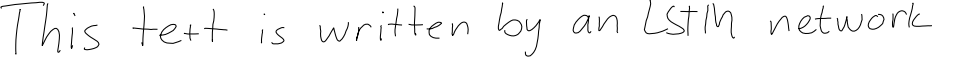
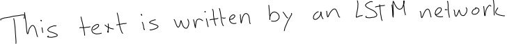

+++
date = "2017-02-17T12:56:49+01:00"
description = "Different showcases of LSTM neural network usages"
title = "The magic of LSTM neural networks"
author ="Assaad Moawad"

+++

# Introduction
[LSTM Neural Networks] (https://en.wikipedia.org/wiki/Long_short-term_memory), which stand for **L**ong **S**hort-**T**erm **M**emory, are a particular type of recurrent neural networks that got lot of attention the last few years within the machine learning community. 


In a simple way, LSTM networks have some internal **contextual state cells** that act as long-term or short-term memory cells. 
The output of the LSTM network is **modulated** by the state of these memory cells. This is a very important property when we want the prediction of the neural network to depend on the **historical context** of inputs, rather than only on the last input.

As a simple example, consider that we want to predict the next number of the following sequence:  6 -> 7 -> 8 -> ?. We would like to have the prediction to be **9**. However, if we provide this sequence: 2 -> 4 -> 8 -> ?, we would like to get the prediction of **16**.
Although in both cases, the current last input was number **8**, the prediction outcome should be different (because we want take into account the contextual information of previous values and not only the last one).

LSTM networks manage to achieve this goal by integrating a **loop** that allows information to be passed from one step of the network to the next. These loops make recurrent neural networks seem magical. But if we think about it for a second, as you read this post, you understand each word based on your understanding of the previous words. You don’t throw everything away and start thinking from scratch again at each word.


*LSTM loop unrolled, showing how LSTM networks can pass contextual information through time.*

On the other hand, the more time passes, the less likely it becomes that the next event depends on a very old one. This time dependency distance itself is as well a contextual information. LSTM networks achieve this by **learning when to remember and learning when to forget**, through their forget gate weights.  


*LSTM internal wiring - Ct is the memory cell, Ft is the forget gate that drives the memory cell to forget the past.*


In this post, I won't go through the technical details of how LSTM are implemented. [This blog post] (http://colah.github.io/posts/2015-08-Understanding-LSTMs/) explains very nicely the rational behind them. Instead I will show the different applications usages. 


# Examples of LSTM usage

## Text Generation
Generating a text, like this one, can be seen as an LSTM task where each letter is generated taking into account all the previously generated letters. [Andrej Karpathy,](http://karpathy.github.io/2015/05/21/rnn-effectiveness/) shows different examples of text generation by LSTM depending on the training set. These are some of the automatically generated texts. Notice how it learns the structures  

### Shakespear: 
```
PANDARUS:
Alas, I think he shall be come approached and the day
When little srain would be attain'd into being never fed,
And who is but a chain and subjects of his death,
I should not sleep.

Second Senator:
They are away this miseries, produced upon my soul,
Breaking and strongly should be buried, when I perish
The earth and thoughts of many states.
```


### Wikipedia: 
```
Naturalism and decision for the majority of Arab countries' capitalide was grounded
by the Irish language by [[John Clair]], [[An Imperial Japanese Revolt]], associated 
with Guangzham's sovereignty. His generals were the powerful ruler of the Portugal 
in the [[Protestant Immineners]], which could be said to be directly in Cantonese 
Communication, which followed a ceremony and set inspired prison, training. The 
emperor travelled back to [[Antioch, Perth, October 25|21]] to note, the Kingdom 
of Costa Rica, unsuccessful fashioned the [[Thrales]], [[Cynth's Dajoard]], known 
in western [[Scotland]], near Italy to the conquest of India with the conflict.
```

### XML: 
```
 <revision>
    <id>15900676</id>
    <timestamp>2002-08-03T18:14:12Z</timestamp>
    <contributor>
      <username>Paris</username>
      <id>23</id>
    </contributor>
    <minor />
    <comment>Automated conversion</comment>
  </revision>
```

## Handwriting recognition

https://youtu.be/mLxsbWAYIpw
This is animation from Alex Graves, requires a little bit of explanation:

- Row 1: Shows the letters that are recognised
- Row 2: Shows the states of the memory cells (Notice how they get reset when a character is recognized!)
- Row 3: Shows the writing as it's being analyzed by the LSTM RNN
- Row 4: This shows the gradient backpropagated to the inputs from the most active characters. This reflects the **forget** effect. 


## Handwriting generation
As an opposite experiment, here are some handwriting generated by LSTM. 






For a live demo, and to generate a handwriting-like text like these, check here: [http://www.cs.toronto.edu/~graves/handwriting.html](http://www.cs.toronto.edu/~graves/handwriting.html)


## Music generation

## Language Translation

## Image captioning

## Forecasting


#References
- [Understanding LSTM] (http://colah.github.io/posts/2015-08-Understanding-LSTMs/)
- [Combination of research papers] (https://amundtveit.com/2016/11/12/deep-learning-with-recurrentrecursive-neural-networks-rnn-iclr-2017-discoveries/)
- [RNN effectiveness](http://karpathy.github.io/2015/05/21/rnn-effectiveness/)
- [Deep learning 4j](https://deeplearning4j.org/lstm.html)
- [Handwriting recognition] (http://nikhilbuduma.com/2015/01/11/a-deep-dive-into-recurrent-neural-networks/)


