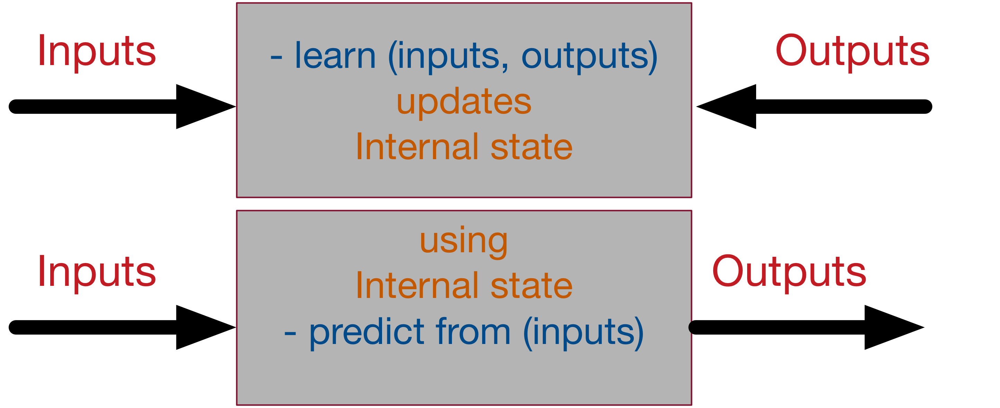
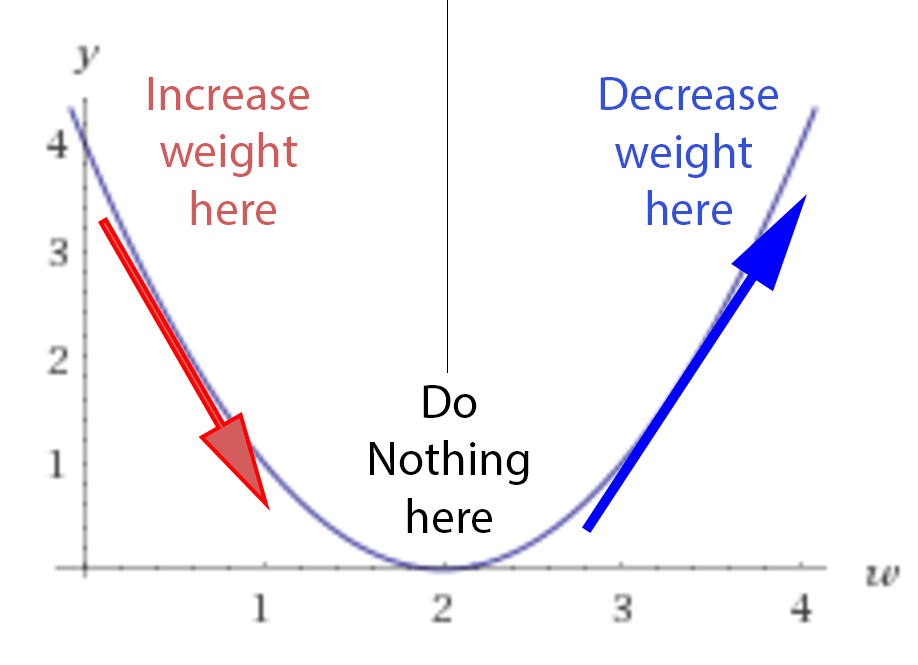
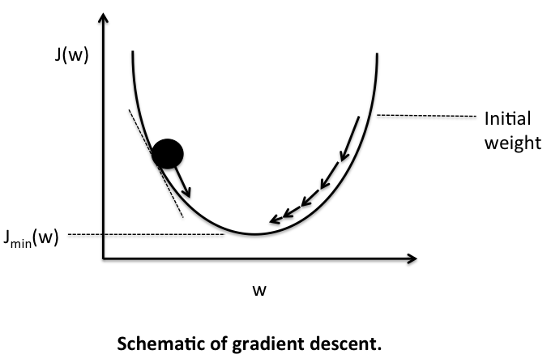
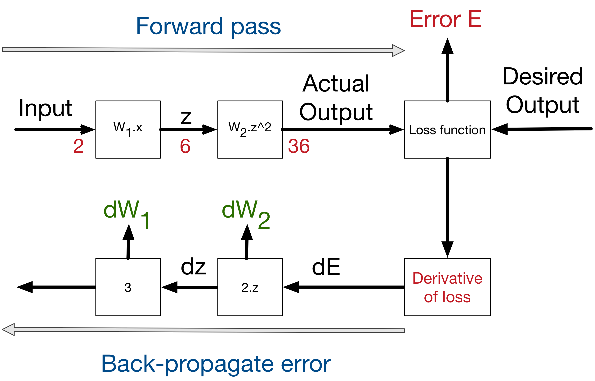

---

title: "Neural networks and backpropagation explained in a simple way"
description: "Explaining neural network and the backpropagation mechanism in the simplest and most abstract way ever!"
author: "Assaad Moawad"
date: "2017-02-23T13:48:03+01:00"
categories: ["machine learning", "neural networks"]
tags: ["neural networks", "backpropagation", "educational"]
image: "images/headers/neural.jpg"
---

Any complex system can be abstracted in a simple way, or at least dissected to its basic abstract components. Complexity arises by the accumulation of several simple layers. The goal of this post, is to explain how neural networks work with the most simple abstraction. We will try to reduce the machine learning mechanism in NN to its basic abstract components. Unlike other posts that explain neural networks, we will try to use the least possible amount of mathematical equations and programming code, and focus only on the abstract concepts.

A supervised neural network, at the highest and simplest abstract representation, can be presented as a black box with 2 methods learn and predict as following:



The learning process takes the inputs and the desired outputs and updates its internal state accordingly, so the calculated output get as close as possible from the desired output. The predict process takes input and generate, using the internal state, the most likely output according to its past *"training experience"*. That's why machine learning is called sometimes **model fitting**.

In order to achieve this, we will decompose the learning process into its several building blocks:

# A simple numerical example
The easiest example to start with neural network and supervised learning, is to start simply with one input and one output and a linear relation between them. The goal of the supervised neural network is to try to search over all the possible linear functions which one fits the best the data. Take for instance the following dataset:  

Input | Desired output
----- | -----------
0 | 0
1 | 2
2 | 4
3 | 6
4 | 8

For this example, it might seems very obvious that the **output = 2 x input**, however it is not the case for most of the real datasets (where the relationship between the input and output is highly non-linear).


## Step 1- Model initialisation
The first step of the learning, is to start from somewhere: the initial hypothesis. Like in genetic algorithms and evolution theory, neural networks can start from anywhere. Thus a **random initialisation** of the model is a common practice. The rational behind is that from wherever we start, if we are perseverant enough and through an iterative learning process, we can reach the pseudo-ideal model.

In order to give an analogy, take for instance a person who has never played football in his life. The very first time he tries to shoot the ball, he can just shoot it randomly. Similarly, for our numerical case study, let's consider the following random initialisation: **(Model 1): y=3.x**. The number **3** here is generated at random. Another random initialisation can be: **(Model 2): y=5.x**, or **(Model 3): y=0,5.x**.
We will explore later, how, through the learning process, all of these models can converge to the ideal solution **(y=2.x)** (which we are trying to find).

In this example, we are exploring which model of the generic form *y=W.x* can fit the best the current dataset. Where **W** is called the *weights* of the network and can be initialised randomly. These types of models are simply called feed-forward linear layers.


## Step 2- Forward propagate

The natural step to do after initialising the model at random, is to check its performance.
We start from the input we have, we pass them through the network layer and calculate the actual output of the model streightforwardly.

Input | Actual output of model 1 (y= 3.x)
---|---
0 | 0
1 | 3
2 | 6
3 | 9
4 | 12

This step is called forward-propagation, because the calculation flow is going in the natural **forward** direction from the input -> through the neural network -> to the output.

## Step 3- Loss function
At this stage, in one hand, we have the actual output of the randomly initialised neural network.
On the other hand, we have the desired output we would like the network to **learn**.
Let's put them all in the same table.

Input | Actual output | Desired output
---|---|---
0 | 0 | 0
1 | 3 | 2
2 | 6 | 4
3 | 9 | 6
4 | 12| 8

If we compare this to our football player shooting for the first time, the actual output will be the final position of the ball, the desired output would be that the ball goes inside the goal. In the beginning, our player is just shooting randomly. Let's say the ball went most of the time, to the right side of the goal. What he can learn from this, is that he needs to shoot a bit more to the left next time he trains.

In order to be able to generalise to any problem, we define what we call: **loss function**. Basically it is a performance metric on how well the NN manages to reach its goal of generating outputs as close as possible to the desired values.

The most intuitive loss function is simply *loss = (Desired output - actual output)*. However this loss function returns positive values when the network undershoot (prediction < desired output), and negative values when the network overshoot (prediction > desired output). If we want the loss function to reflect an **absolute error** on the performance regardless if it's overshooting or undershooting we can define it as:
*loss = Abstract value of (desired - actual )*. If we go back to our football player example, if our newbie guy shoots the ball 10m to the right or 10m to the left of the goal, we consider, in both cases, that he missed its target by 10m regardless the direction (right or left).
In this case we will add a new column to the table -> *the absolute error*.

However, several situations can lead to the same total sum of errors: for instance, lot of small errors or few big errors can sum up exactly to the same total amount of error. Since we would like the prediction to work under **any** situation, it is more preferable to have a distribution of lot of small errors, rather than a few big ones.
In order to encourage the NN to converge to such situation, we can define the loss function to be the **Sum of squares** of the absolute errors (which is the most famous loss function in NN). This way, small errors are counted much less than large errors! (the square of 2 is 4, but the square of 10 is 100! So an error of 10, is penalised 25 times more than an error of 2 - not only 5 times!)

Our table becomes the following:

Input | actual | Desired | Absolute Error | Square Error
---|---|---|---|---
0 | 0 | 0 | 0 | 0
1 | 3 | 2 | 1 | 1
2 | 6 | 4 | 2 | 4
3 | 9 | 6 | 3 | 9
4 | 12 | 8 | 4 | 16
Total:|-|-|**10**| **30**


Notice how, if we consider only the first input 0, we can say that the network predicted correctly the result!
However, this is just the beginner's luck in our football player analogy who can manage to score from the first shoot as well. What we care about, is to minimise the overall error over the whole dataset (total of the sum of the squares of the errors!).


```
As a summary, the loss function is an error metric, that gives an indicator on how much precision we lose, if we replace the real desired output by the actual output generated by our trained neural network model. That's why it's called **loss**!
```

Simply speaking, the machine learning goal becomes then to minimise the loss function (to reach as close as possible to 0).
We can just transform our machine learning problem now to an optimisation process that aims to minimise this loss function.

## Step 4- Differentiation
Obviously we can use any optimisation technique that modifies the internal weights of neural networks in order to minimise the total loss function that we previously defined. These techniques can include genetic algorithms or greedy search or even a simple brute-force search:
In our simple numerical example, with only one parameter of weight to optimize **W**, we can search from -1000.0 to +1000.0 step 0.001, which **W** has the smallest sum of squares of errors over the dataset.

This might works if the model has only very few parameters and we don't care much about precision. However, if we are training the NN over an array of 600x400 inputs (like in image processing), we can reach very easily models with millions of weights to optimise and brute force can't be even be imaginable, since it's a pure waste of computational resources!

Luckily for us, there is a powerful concept in mathematics that can guide us how to optimise the weights called differentiation. Basically it deals with the derivative of the loss function. In mathematics, the derivative of a function at a certain point, gives the rate or the speed of which this function is changing its values at this point.  


In order to see the effect of the derivative, we can ask ourselves the following question: how much the total error will change if we change the internal weight of the neural network with a certain small value **δW**. For the sake of simplicity will consider δW=0.0001. in reality it should be much smaller!.

Let's recalculate the sum of the squares of errors when the weight **W** changes very slightly:

Input | Desired Output | W=3 | Square Error | W=3.0001 | Square Error
---|---|---|---|---|---
0 | 0 | 0 | 0 | 0 | 0
1 | 2 | 3 | 1 | 3.0001 |1.0002
2 | 4 | 6 | 4 | 6.0002 |4.0008
3 | 6 | 9 | 9 | 9.0003 |9.0018
4 | 8 | 12 | 16 | 12.0004 |16.0032
Total:|-|-| **30** |- | **30.006**

Now as we can see from this table, if we increase **W** from 3 to 3.0001, the sum of squares of error will increase from 30 to 30.006. Since we know that the best function that fits this model is **y=2.x**, increasing the weights from 3 to 3.0001 should obviously create a little bit more error (because we are going further from the intuitive correct weight of 2. 3.0001 > 3 > 2 thus the error is higher)  
But what we really care about is the rate of which the error changes **relatively** to the changes on the weight.
Basically here this rate is the increase of 0.006 in the total error for each 0.0001 increasing weight -> that's a rate of 0.006/0.0001 = 60x!
It works in both direction, so basically if we decrease the weights by 0.0001, we should be able to decrease the total error by 0.006 as well!
Here is the proof, if you run again the calculation, at **W=2.9999** you get an error of **29.994**. We managed to decrease the total error!

We could have guessed this rate by calculating directly the derivative of the loss function.
The advantage of using the mathematical derivative is that it is much faster and more precise to calculate (less floating point precision problems).

Here is what our loss function looks like:

- If w=2, we have a loss of 0, since the neural network actual output will fit perfectly the training set.
- If w<2, we have a positive loss function, but the derivative is negative, meaning that an increase of weight will decrease the loss function.
- At w=2, the loss is 0 and the derivative is 0, we reached a perfect model, nothing is needed.
- If w>2, the loss becomes positive again, but the derivative is as well positive, meaning that any more increase in the weight, will increase the losses even more!!  



If we initialise randomly the network, we are putting any random point on this curve (let's say **w=3**) . The learning process is actually saying this:

- Let's check the derivative.
- If it is positive, meaning the error increases if we increase the weights, then we should decrease the weight.
- If it's negative, meaning the error decreases if we increase the weights, then we should increase the weight.
- If it's 0, we do nothing, we reach our stable point.

In a simple matter, we are designing a process that acts like gravity. No matter where we randomly initialise the ball on this error function curve, there is a kind of force field that drives the ball back to the lowest energy level of ground 0.




## Step 5- Backpropagation
In this example, we used only one layer inside the neural network between the inputs and the outputs. In many cases, more layers are needed, in order to reach more variations in the functionality of the neural network.
For sure, we can always create one complicated function that represent the composition over the whole layers of the network. For instance, if layer 1 is doing: 3.x to generate a hidden output z, and layer 2 is doing: z^2 to generate the final output, the composed network will be doing (3.x)^2 = 9.x^2. However in most cases composing the functions is very hard. Plus for every composition one has to calculate the dedicated derivative of the composition (which is not at all scalable and very error prone).  


In order to solve the problem, luckily for us, derivative is decomposable, thus can be back-propagated.
We have the starting point of errors, which is the loss function, and we know how to derivate it, and if we know how to derivate each function from the composition, we can propagate back the error from the end to the start.
Let's consider the simple linear example: where we multiply the input 3 times to get a hidden layer, then we multiply the hidden (middle layer) 2 times to get the output.

input -> 3.x -> 2.x -> output.

A 0.001 delta change on the input, will be translated to a 0.003 delta change after the first layer, then to 0.006 delta change on the output.
which is the case if we compose both functions into one:

input -> 6.x -> output.

Similarly an error on the output of 0.006, can be backpropagated to an error of 0.003 in the middle hidden stage, then to 0.001 on the input.
If we create a library of **differentiable** functions or layers where for each function we know how to forward-propagate (by directly applying the function) and how to back-propagate (by knowing the derivative of the function), we can compose any complex neural network. We only need to keep a stack of the function calls during the forward pass and their parameters, in order to know the way back to backpropagate the errors using the derivatives of these functions. This can be done by de-stacking through the function calls. This technique is called auto-differentiation, and requires only that each function is provided with the implementation of its derivative. In a future blog post, we will explain how to accelerate auto-differentiation by implementing basic mathematical operations over matrices.

Now any layer can forward its results to many other layers, in this case, in order to do backpropagation, we sum the deltas coming from all the target layers. Thus our calculation stack can become [a complex calculation graph](https://cdn.thenewstack.io/media/2015/11/tensorflow-1.png).


This figure shows the process of backpropagating errors following this schemas:
Input -> Forward calls -> Loss function -> derivative -> backpropagation of errors. At each stage we get the deltas on the weights of this stage.




## Step 6- Weight update

As we presented earlier, the derivative is just the rate of which the error changes relatively to the weight changes. In the numerical example presented earlier, this rate is 60x. Meaning that 1 unit of change in weights leads to 60 units change in error.
And since we know that the error is currently at 30 units, by extrapolating the rate, in order to reduce the error to 0, we need to reduce the weights by 0.5 units.
However, for real-life problems we shouldn't update the weights with such big steps. Since there are lot of non-linearities, any big change in weights will lead to a chaotic behaviour. We should not forget that the derivative is only local at the point where we are calculating the derivative.

Thus as a general rule of weight updates is the [delta rule](http://www.cs.stir.ac.uk/courses/ITNP4B/lectures/kms/3-DeltaRule.pdf):

```
New weight = old weight - Derivative Rate * learning rate
```

The learning rate is introduced as a constant (usually very small), in order to force the weight to get updated very smoothly and slowly (to avoid big steps and chaotic behaviour).

In order to validate this equation:

 - If the derivative rate is positive, it means that an increase in weight will increase the error, thus the new weight should be smaller.
 - If the derivative rate is negative, it means that an increase in weight will decrease the error, thus we need to increase the weights.
 - If the derivative is 0, it means that we are in a stable minimum. Thus, no update on the weights is needed -> we reached a stable state.

Now several weight update methods exist. These methods are often called **optimisers**. The delta rule is the most simple and intuitive one, however it has several draw-backs. This [excellent blog post] (http://sebastianruder.com/optimizing-gradient-descent/) presents the different methods available to update the weights.

In the numerical example we presented here, we only have 5 input/output training set. In reality, we might have millions of entries. Previously, we were talking about minimising the error cost function (the loss function) over the whole dataset. This is called batch learning, and might be very slow for big data. What we can do instead, is to to update the weights every **batch-size=N** of training, providing that the dataset is shuffled randomly. This is called mini-batch gradient descend. And if **N=1**, we call this case full online-learning or stochastic gradient descent, since we are updating the weights after each single input output observed!
Any optimiser can work with these 3 modes (full online/mini-batch/full-batch).


## Step 7- Iterate until convergence
Since we update the weights with a small delta step at a time, it will take several iterations in order to learn.
This is very similar to genetic algorithms where after each generation we apply a small mutation rate and the fittest survives.
In neural network, after each iteration, the gradient descent force updates the weights towards less and less global loss function.
The similarity is that the delta rule acts as a mutation operator, and the loss function acts a fitness function to minimise.
The difference is that in genetic algorithms, the mutation is blind. Some mutations are bad, some are good, but the good ones have higher chance to survive. The weight update in NN are however smarter since they are guided by the decreasing gradient force over the error.

How many iterations are needed to converge?

- This depends on how strong the learning rate we are applying. High learning rate means faster learning, but with higher chance of [instability](https://abhishek-choudhary.blogspot.lu/2014/05/machine-learning-3-gradient-descent.html).
- It depends as well on the meta-parameters of the network (how many layers, how complex the non-linear functions are). The more it has variables the more it takes time to converge, but the higher precision it can reach.
- It depends on the optimisation method use, some weight updates rule are proven to be faster than others [for instance AdaDelta](http://sebastianruder.com/content/images/2016/09/saddle_point_evaluation_optimizers.gif).
- It depends on the random initialisation of the network. Maybe with some luck you will initialise the network with **W=1.99** and you are only one step away from the optimal solution.
- It depends on the quality of the training set. If the input and output has no correlation between each other, the neural network will not do magic and can't learn a random correlation.

# Overall picture

In order to summarise, Here is what the learning process on neural networks looks like:


In our GreyCat, the different building blocks of a fully functional neural network are [implemented here](https://github.com/datathings/greycat/tree/master/plugins/ml/src/main/java/greycat/ml/neuralnet).
